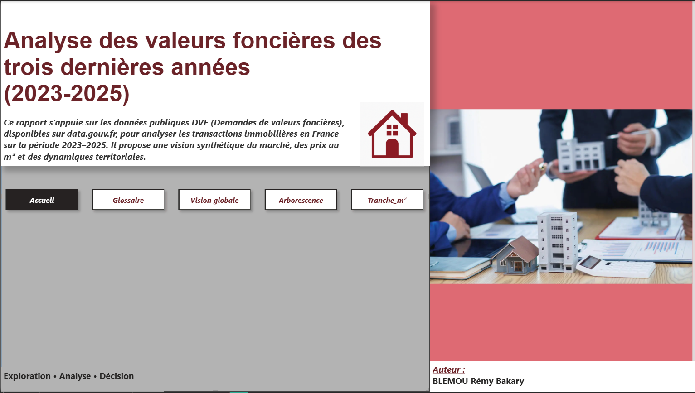
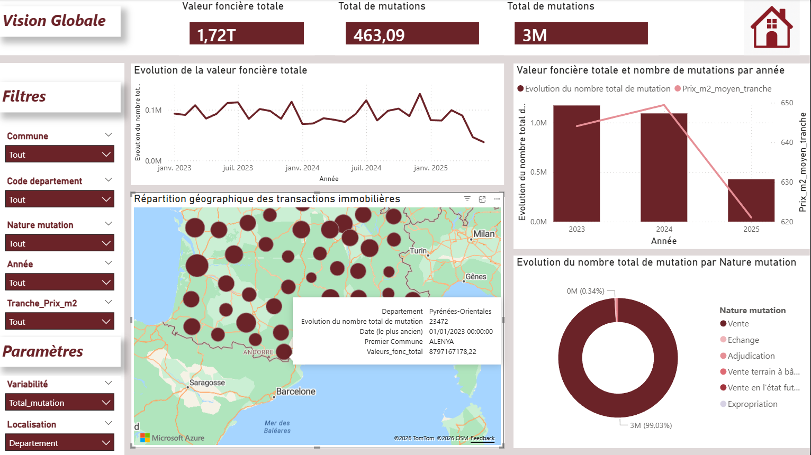
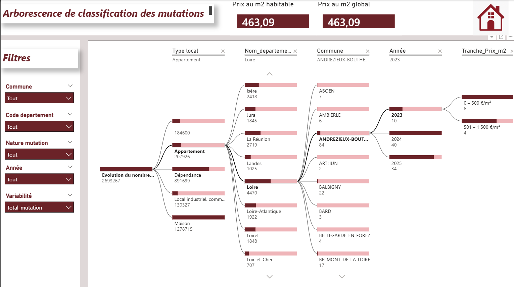
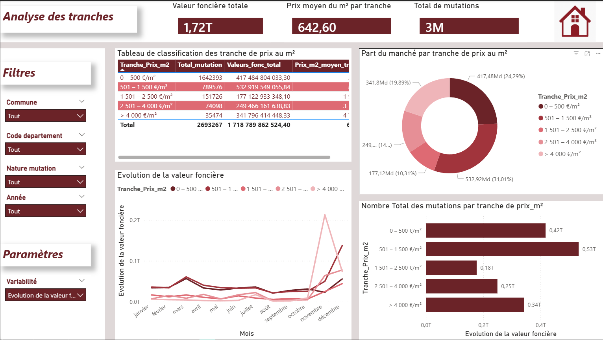

# 🏠 Analyse du marché immobilier avec Power BI

Ce projet vise à analyser le **marché immobilier** à l’aide de **Power BI**, en transformant des données brutes en **indicateurs clairs et dashboards interactifs** afin d’aider à la prise de décision.

---

## 🎯 Objectifs du projet
- Analyser l’évolution des **prix au m²**
- Étudier le volume et la répartition des **transactions immobilières**
- Identifier les **tendances du marché**
- Comparer les biens selon différents critères (localisation, typologie, surface)

---

## 📊 Aperçu des dashboards

### Accueil

### Vue d’ensemble du marché

### Arbre décisionnel

### Tendance – répartition des biens au m²

---

## 📥 Télécharger le fichier Power BI
👉 [Télécharger le fichier Power BI (PBIX)](TON_LIEN_ONEDRIVE_ICI)

> ⚠️ Le fichier PBIX est hébergé sur OneDrive en raison de la limite de taille imposée par GitHub.

---

## 📌 Indicateurs clés analysés
- Prix moyen et médian au m²  
- Nombre de transactions  
- Répartition des biens par zone  
- Évolution temporelle des ventes  
- Typologie des biens (appartements, maisons, etc.)

---

## 🛠️ Outils utilisés
- Power BI  
- DAX  
- Modélisation des données  
- Data visualisation orientée business  

---

## 🧠 Compétences développées
- Nettoyage et structuration des données  
- Création de mesures DAX  
- Conception de dashboards décisionnels  
- Analyse et interprétation de données immobilières
